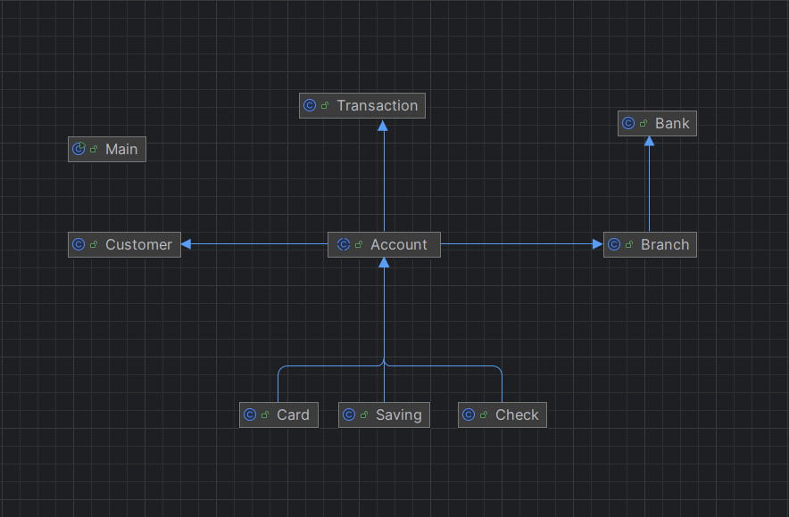

# 🏦 BankUml: Banking System Simulation

Welcome to **BankUml**, a Java-based banking application designed to simulate core banking operations such as account management, transactions, and receipts.  

This project demonstrates the use of Object-Oriented Programming (OOP) principles, including **Inheritance**, **Encapsulation**, **Abstraction**, and **Polymorphism**, strictly following the provided UML diagram.

## 📌 Features

- **Account Management**: Create and manage multiple types of bank accounts.
- **Transaction Handling**: Simulate payments and generate receipts.
- **UML-Driven Design**: Class structure directly follows the given UML diagram.

**Uml**



## 🚀 How to Run

Make sure you have the following installed:

- Java
- Maven (if Lombok is missing or not working correctly)

1. Clone the repository:

```bash
git clone https://github.com/M-PERSIC/BankUml.git
cd BankUml
```

2. Compile the code:

```bash
javac -cp "libs/*" bank/*.java 
```

3. Run the program:

```bash
# Linux/MAC
java -cp ".:libs/*" bank.Main
# Windows
java -cp ".;libs/*" bank.Main
```

To redownload the Lombok jar:

```bash
mvn dependency:copy-dependencies -DoutputDirectory=./libs
```

---

Originally developed by [@shayanaminaei](https://github.com/shayanaminaei)
